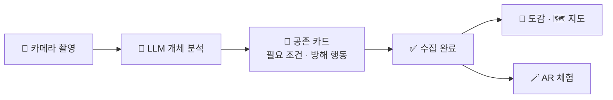
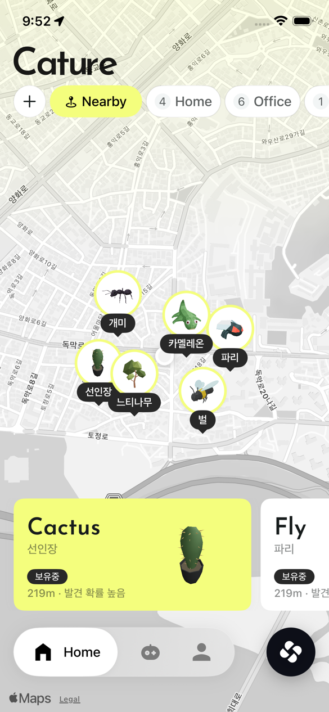
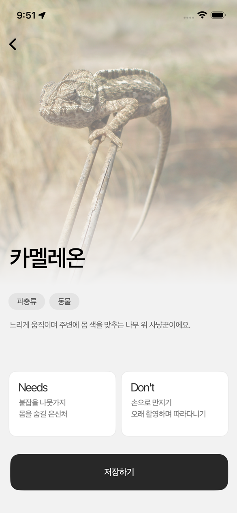
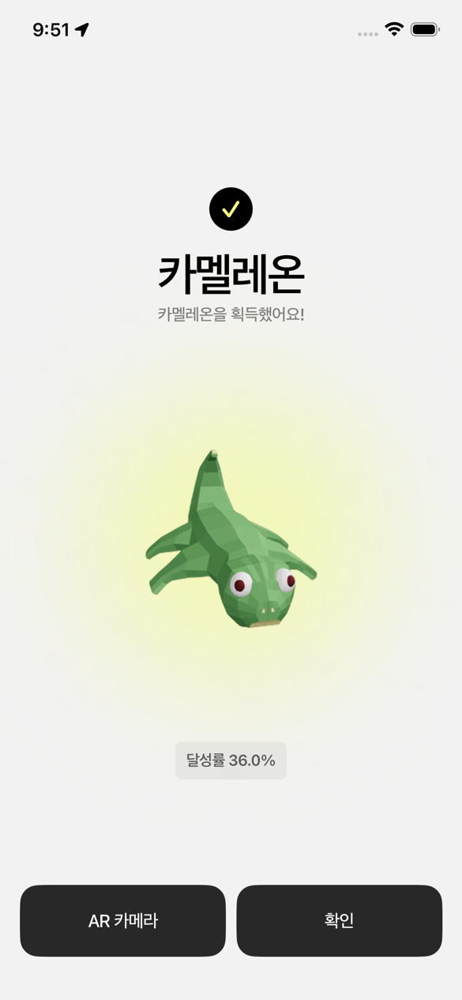
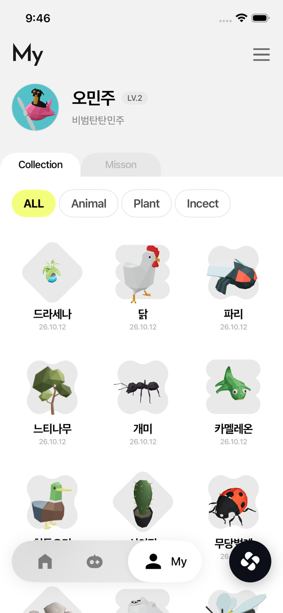
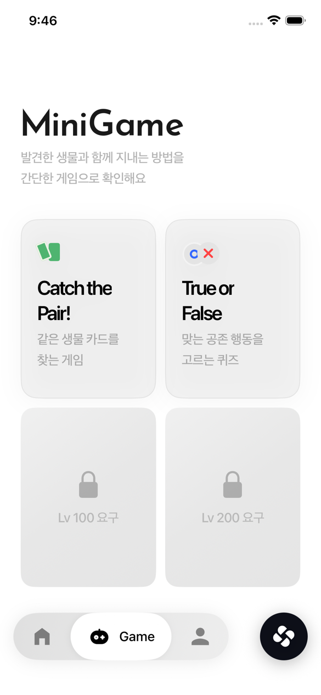
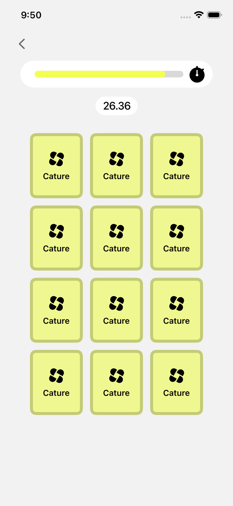
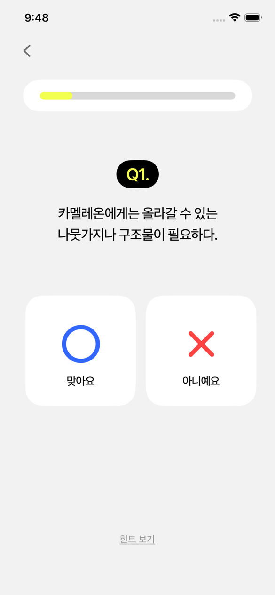
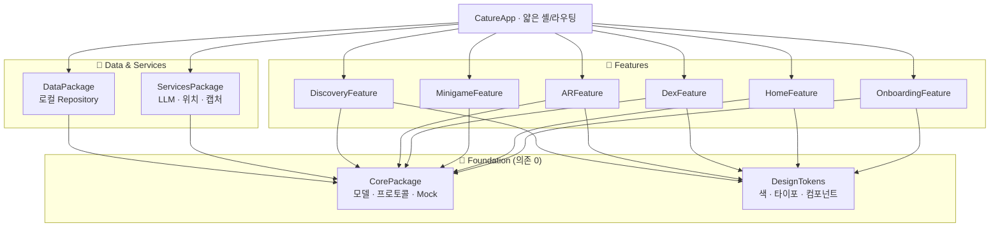

<div align="center">

# 🌿 Cature

**카메라로 만난 생명을 이해하고, 함께 지내는 법을 배우는 iOS 앱**

카메라로 실제 생물을 발견하면 LLM이 개체를 분석하고 *어떻게 함께 지내야 하는지*(필요 조건 · 방해 행동)를 알려줍니다.
발견한 생명은 도감과 지도에 수집되고, AR로 눈앞에 불러내 체험할 수 있어요.

<br/>


</div>

---

## ✨ 골든 패스



> 발견 → 이해 → 수집 → 체험. "잡는" 게 아니라 **함께 지내는 법**을 배우는 흐름이 핵심입니다.

---

## 📱 화면

<table>
  <tr>
    <td align="center" width="25%"><br/><sub><b>발견 지도</b><br/>주변 생명을 핀으로</sub></td>
    <td align="center" width="25%"><br/><sub><b>공존 카드</b><br/>필요 조건 · 방해 행동</sub></td>
    <td align="center" width="25%"><br/><sub><b>획득 완료</b><br/>수집 연출</sub></td>
    <td align="center" width="25%"><br/><sub><b>도감</b><br/>카테고리 필터 · 그리드</sub></td>
  </tr>
  <tr>
    <td align="center"><br/><sub><b>미니게임 허브</b><br/>게임 선택</sub></td>
    <td align="center"><br/><sub><b>카드 짝맞추기</b><br/>Catch Your Card</sub></td>
    <td align="center"><br/><sub><b>OX 퀴즈</b><br/>True or False</sub></td>
    <td align="center"><sub>🪄 <b>AR 체험</b><br/>usdz 모델을 평면에<br/><i>(실기기 전용)</i></sub></td>
  </tr>
</table>

> 실기기 iPhone에서 실제 카메라·위치로 동작합니다. 위 화면은 시뮬레이터 캡처.

---

## 🎮 주요 기능

| | 기능 | 설명 |
|---|---|---|
| 🏠 | **홈 · 지도** | 발견한 생명을 장소별로 모아 보는 모노톤 지도 + 장소 필터 |
| 📸 | **발견 플로우** | 카메라 촬영 → 분석 → 공존 카드 → 획득 완료 연출 |
| 🧠 | **LLM 분석** | OpenAI 기반 개체 식별 + 공존 정보(필요 조건 / 방해 행동), Mock 폴백 |
| 📖 | **도감 (My)** | 프로필 · 카테고리 필터(동물 · 식물 · 곤충) · 3열 그리드 · 종 상세 |
| 🪄 | **AR 체험** | RealityKit `usdz` 모델을 평면에 배치, 이동 · 회전 · 확대 제스처 |
| 🕹️ | **미니게임** | 카드 짝맞추기(Catch Your Card) · True or False OX 퀴즈 |
| 👋 | **온보딩** | 첫 진입 안내 플로우 |

**하단 탭:** `Home` · `Game` · `My` + 중앙 로고 FAB(카메라 발견 진입)

---

## 🧱 아키텍처

**계약 중심 · 의존성 0 코어.** 모든 Feature는 실구현이 아니라 **Core 프로토콜**에 의존하고, 주입(DI)으로 Mock ↔ 실구현을 갈아 끼웁니다. 덕분에 팀이 병렬로, Mock-first로 개발했습니다.



**불변식**
- `CorePackage`·`DesignTokens`는 **의존 0** — 순수 계약/디자인 레이어
- 로직은 패키지에, **앱 타깃은 얇게**(셸 · 라우팅만)
- 색 · 폰트는 하드코딩 금지 → `DesignTokens` 토큰으로만
- 3D 에셋은 `Assets3D/` 한 곳, **Git LFS**로 추적

---

## 🛠️ 기술 스택

| 영역 | 사용 기술 |
|---|---|
| **언어 · UI** | Swift 6.0 · SwiftUI |
| **AR** | ARKit · RealityKit · USDZ |
| **AI** | OpenAI LLM (개체 분석 · 공존 정보) |
| **위치 · 캡처** | CoreLocation · AVFoundation |
| **저장** | 로컬 Repository (온디바이스) |
| **패키징** | Swift Package Manager (로컬 멀티패키지) · Git LFS |

---

## 📂 프로젝트 구조

```
Cature/
├─ CatureApp/            # 앱 셸 · 탭 · 라우팅 (얇게)
├─ Cature.xcodeproj
├─ Packages/
│  ├─ CorePackage/       # 모델 · 프로토콜 · Mock (의존 0)
│  ├─ DesignTokens/      # 색 · 타이포 · 컴포넌트 (의존 0)
│  ├─ DataPackage/       # 로컬 Repository 구현
│  ├─ ServicesPackage/   # LLM · 위치 · 캡처
│  ├─ DiscoveryFeature/  # 카메라 · 분석 · 공존 카드 · 수집 연출
│  ├─ ARFeature/         # RealityKit usdz 체험
│  ├─ DexFeature/        # 도감(My) · 종 상세
│  ├─ MinigameFeature/   # 카드 짝맞추기 · OX 퀴즈
│  ├─ HomeFeature/       # 홈 · 지도
│  └─ OnboardingFeature/ # 온보딩
├─ Assets3D/             # usdz/glb 3D 에셋 (Git LFS)
└─ docs/                 # PRD · 협업 프로세스 · 플레이북
```

---

## 🚀 빌드 & 실행

> **요구 사항:** macOS · Xcode 16+ · iOS 17+ · [Git LFS](https://git-lfs.com)

```bash
# 1) 클론 + LFS 3D 에셋 받기
git clone https://github.com/cherrymixy/Cature.git
cd Cature
git lfs install && git lfs pull

# 2) 앱 전체 그래프 빌드 (10개 패키지 + 앱)
xcodebuild -project Cature.xcodeproj -scheme CatureApp \
  -destination 'generic/platform=iOS Simulator' build

# 3) 개별 패키지 단독 컴파일
cd Packages/CorePackage && swift build
```

또는 `Cature.xcodeproj`를 Xcode에서 열고 **CatureApp** 스킴으로 실행하세요.

> 📱 **AR · 촬영 · 위치는 실기기(iPhone) 검증** 권장 — 시뮬레이터에서는 카메라/AR 렌더가 제한됩니다.

---

## 👥 팀 & 협업

3인 병렬 개발. **공유 표면(Core · 토큰 · 셸)을 먼저 얼려** 병렬 개발의 관문을 열고, 각자 Feature를 Mock-first로 구현했습니다.

| 이름 | 도구 | 담당 |
|---|---|---|
| **승아** | Claude Code | 초기 세팅 · 코어/계약 · 발견 플로우 · AR |
| **찬희** | Codex | 도감 · 미니게임 |
| **예준** | Codex | 홈 · 온보딩 |

---

## 📚 문서

| 문서 | 내용 |
|---|---|
| [`docs/PRD.md`](docs/PRD.md) | 제품 요구사항 · 빌드 SSOT |
| [`docs/협업_프로세스.md`](docs/협업_프로세스.md) | 3인 협업 모델 · 도구 분업 |
| [`docs/contracts.md`](docs/contracts.md) | Core 계약(프로토콜) 명세 |
| [`docs/tokens.md`](docs/tokens.md) | 디자인 토큰 |
| [`docs/playbook/`](docs/playbook/) | 빌드 플레이북(관문 · 타임라인) |

<div align="center">
<br/>

**🌿 Cature** — 발견에서 공존으로.

</div>
