<div align="center">

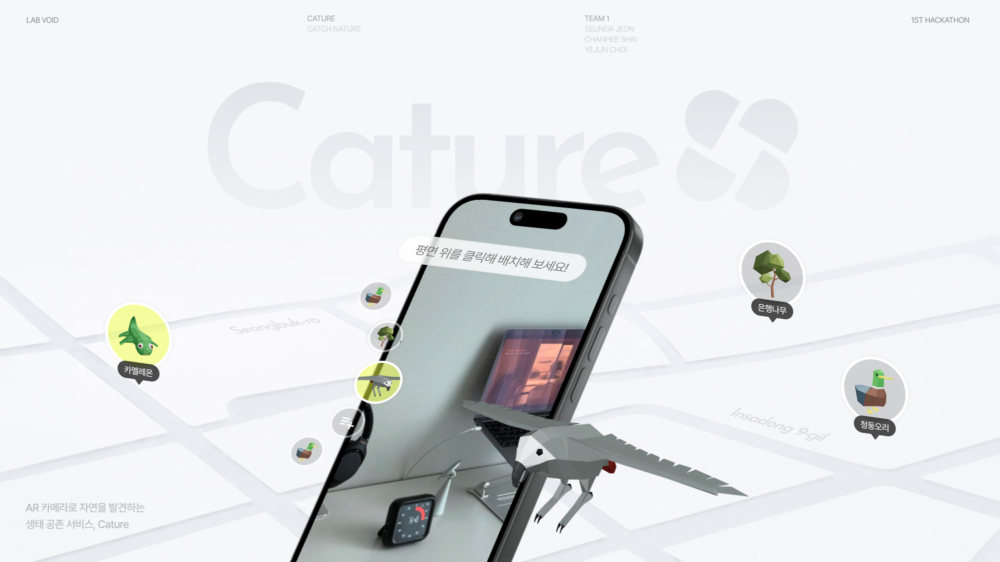

<br/><br/>

# 🌿 Cature

### 카메라로 도시 속 생명을 발견하고, AI로 공존을 이해하며, AR로 다시 만나다

**Catch + Nature** — 일상 속 스쳐 지나가던 자연을 *포착*하는 iOS 앱.
카메라로 생물을 발견하면 LLM이 개체를 분석하고 *어떻게 함께 지내야 하는지*(필요 조건 · 방해 행동)를 알려줍니다.
발견한 생명은 도감·지도에 수집되고, AR로 눈앞에 불러내 다시 체험할 수 있어요.

<br/>


<sub>🏆 1위 Winner · Team LAB VOID · Seunga Jeon · Chanhee Shin · Yejun Choi</sub>

<br/>

> 🏆 **Lab Void 바이브코딩 해커톤 1위(Winner)**
> 홍익대학교 UX/UI 소모임 **Lab Void** — *디자이너들끼리* 진행한 바이브코딩 해커톤에서, AI 코딩 도구로 직접 만든 iOS 앱으로 **1위**를 차지했습니다.

</div>

---

<div align="center">

> ### “도시는 사람만의 공간이 아니라, 식물·곤충·새·버섯·야생동물이 함께 살아가는 생활권입니다.”
> **발견(Discover) → 이해(Understand) → 체험(Experience).** “잡는” 게 아니라 **함께 지내는 법**을 배우는 흐름이 Cature의 핵심입니다.

</div>

---

## 📑 목차

[**기획**](#-기획--왜-cature인가) · [**타겟 전략**](#-타겟-전략) · [**한 문장 정의**](#-한-문장-정의-5w1h) · [**브랜드**](#-브랜드-아이덴티티) · [**디자인 시스템**](#-디자인-시스템) · [**Core Value**](#-core-value--세-가지-핵심-경험) · [**Core Flow**](#-core-flow) · [**화면**](#-실제-화면) · [**기능**](#-주요-기능) · [**아키텍처**](#-아키텍처) · [**기술 스택**](#-기술-스택) · [**빌드**](#-빌드--실행) · [**팀**](#-팀--협업)

---

## 🎯 기획 — 왜 Cature인가

도시는 사람만의 공간이 아니라 여러 생명이 함께 살아가는 생활권입니다. 하지만 일상 속 도시 생명은 대부분 **배경처럼 지나쳐지고**, 사용자는 생물을 발견하더라도 *이름 이상의 정보*와 *함께 살아가는 방식*을 이해하기 어렵습니다.

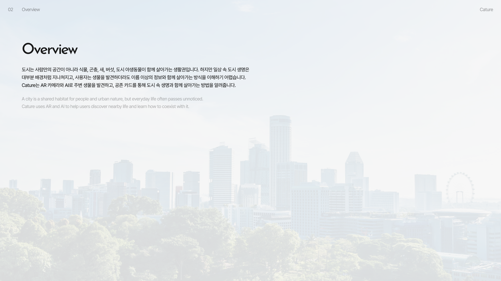

### 우리가 발견한 3가지 문제

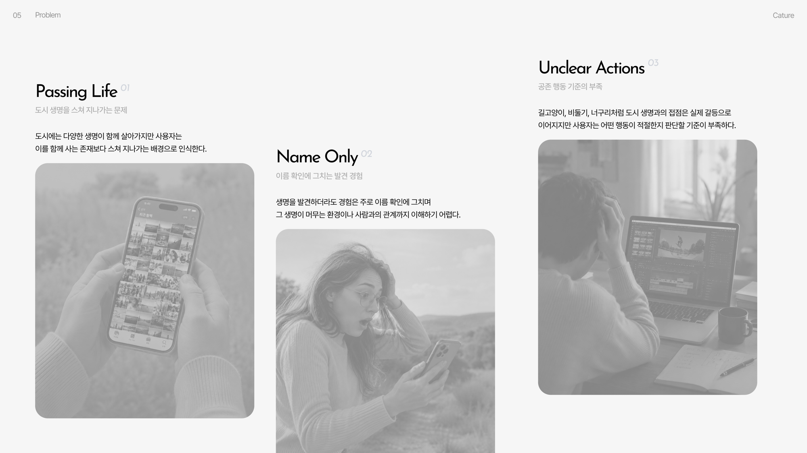

| | 문제 | 설명 |
|---|---|---|
| **01 · Passing Life** | 도시 생명을 스쳐 지나가는 문제 | 다양한 생명이 함께 살아가지만, 사용자는 이를 *함께 사는 존재*보다 스쳐 지나가는 배경으로 인식한다. |
| **02 · Name Only** | 이름 확인에 그치는 발견 경험 | 생명을 발견하더라도 경험은 주로 *이름 확인*에 그치며, 그 생명이 머무는 환경이나 사람과의 관계까지 이해하기 어렵다. |
| **03 · Unclear Actions** | 공존 행동 기준의 부족 | 길고양이·비둘기·너구리처럼 도시 생명과의 접점은 실제 갈등으로 이어지지만, 어떤 행동이 적절한지 판단할 기준이 부족하다. |

### 데스크 리서치 — 인식과 행동 사이의 간극

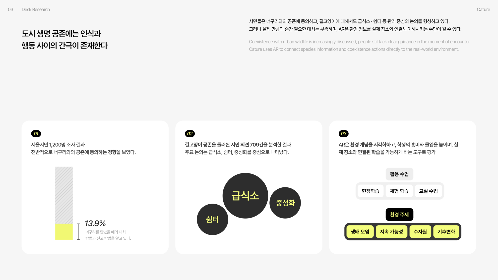

- **서울시민 1,200명 조사** — 전반적으로 너구리와의 공존에 동의하지만, 실제로 만났을 때 대처·신고 방법을 아는 사람은 **13.9%**에 불과.
- **길고양이 공존 시민 의견 709건 분석** — 주요 논의는 *급식소 · 쉼터 · 중성화*를 중심으로 형성.
- **AR은 환경 개념을 시각화**하고 흥미·몰입을 높이며, 실제 장소와 연결된 학습을 가능하게 하는 도구로 평가됨.

> 시민들은 공존에 **동의**하지만, 정작 **만남의 순간에 필요한 대처는 부족**합니다. Cature는 AR로 종 정보와 공존 행동을 *실제 장소에 연결해* 이 간극을 메웁니다.

### 기존 서비스의 빈틈

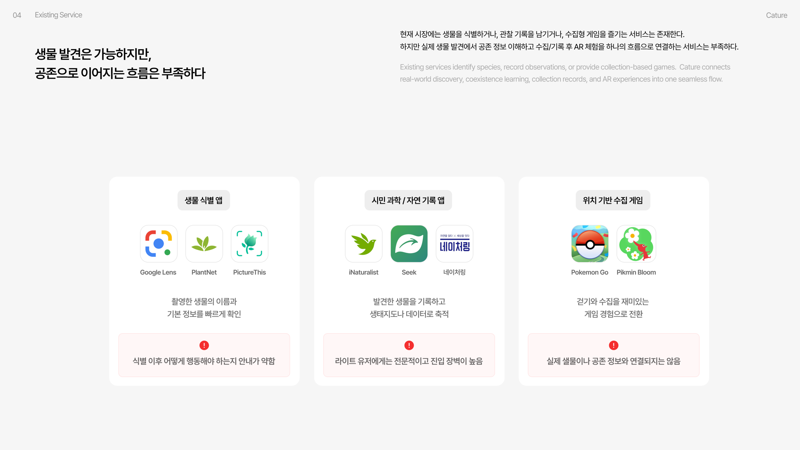

| 카테고리 | 대표 서비스 | 한계 |
|---|---|---|
| 🔍 생물 식별 앱 | Google Lens · PlantNet · PictureThis | 식별 이후 *어떻게 행동해야 하는지* 안내가 약함 |
| 📓 시민 과학 · 기록 앱 | iNaturalist · Seek · 네이처링 | 라이트 유저에게는 전문적이고 진입 장벽이 높음 |
| 🎮 위치 기반 수집 게임 | Pokémon GO · Pikmin Bloom | 실제 생물이나 공존 정보와 연결되지는 않음 |

> **발견은 가능하지만, 공존으로 이어지는 흐름은 없다.** Cature는 *실제 발견 → 공존 학습 → 수집 기록 → AR 체험*을 **하나의 매끄러운 흐름**으로 연결합니다.

---

## 🧭 타겟 전략

“자연을 그냥 지나치던 사용자”를 *발견하고, 관찰하고, 기록하는 사람*으로 변화시킵니다. AR 카메라와 AI 인식으로 진입 장벽을 낮추고, 게임을 통해 지속적인 공존으로 이어지게 합니다.

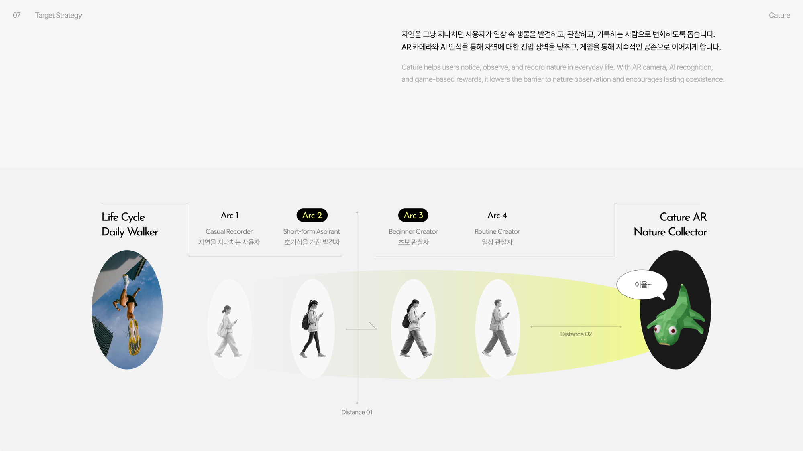

**Daily Walker → Cature AR Nature Collector.** 자연을 스쳐 지나가던 사용자(Arc 1)가 호기심을 가진 발견자(Arc 2), 초보 관찰자(Arc 3), 일상 관찰자(Arc 4)를 거쳐 *일상 속 자연 수집가*로 성장하는 여정을 설계했습니다.

---

## ✍️ 한 문장 정의 (5W1H)

> **카메라로 도시 속 동식물을 발견하고, AI 분석으로 공존하는 AR 수집 서비스.**

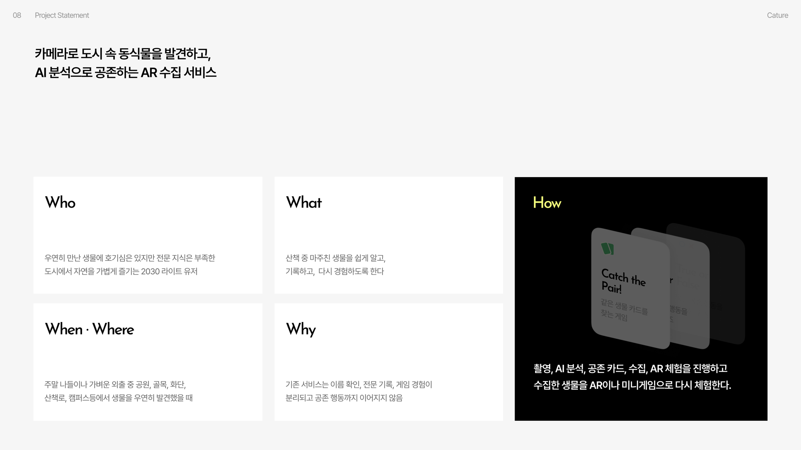

| | |
|---|---|
| **Who** | 우연히 만난 생물에 호기심은 있지만 전문 지식은 부족한, 도시에서 자연을 가볍게 즐기는 **2030 라이트 유저** |
| **What** | 산책 중 마주친 생물을 쉽게 알고, 기록하고, 다시 경험하도록 한다 |
| **When · Where** | 주말 나들이·가벼운 외출 중 공원·골목·화단·산책로·캠퍼스 등에서 생물을 우연히 발견했을 때 |
| **Why** | 기존 서비스는 이름 확인·전문 기록·게임 경험이 분리되고 *공존 행동까지 이어지지 않기* 때문 |
| **How** | 촬영 · AI 분석 · 공존 카드 · 수집 · AR 체험을 하나로 잇고, 수집한 생물을 AR·미니게임으로 다시 체험한다 |

---

## 🎨 브랜드 아이덴티티

### Naming — Catch + Nature

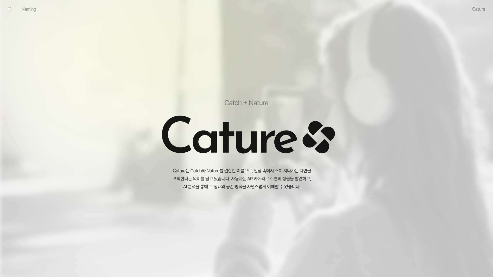

**Cature**는 **Catch**와 **Nature**를 결합한 이름으로, *일상 속에서 스쳐 지나가는 자연을 포착한다*는 의미를 담고 있습니다. 사용자는 AR 카메라로 주변의 생물을 발견하고, AI 분석을 통해 그 생태와 공존 방식을 자연스럽게 이해할 수 있습니다.

### Symbol — 셔터 + 클로버

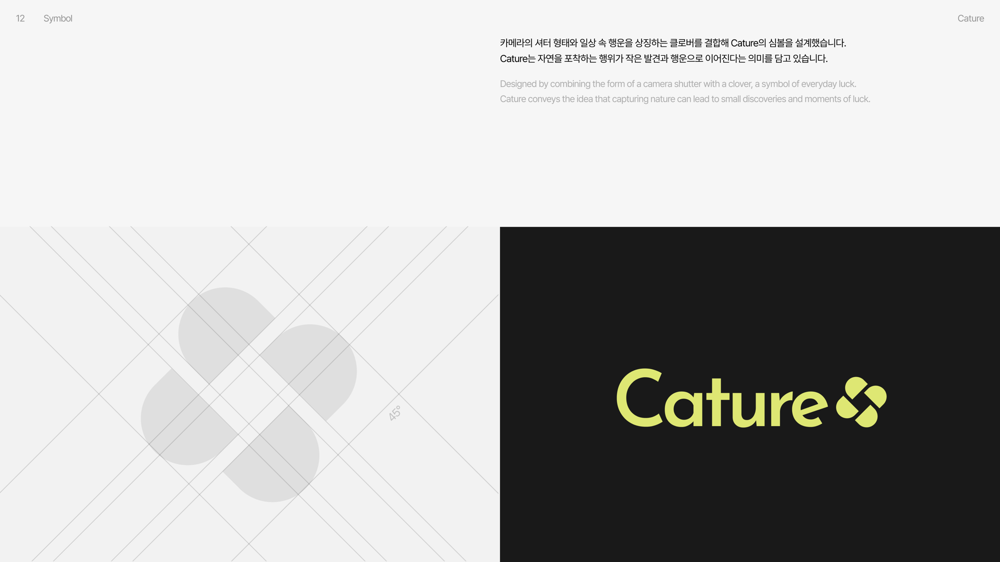

카메라의 **셔터 형태**와 일상 속 행운을 상징하는 **클로버**를 결합해 심볼을 설계했습니다. *자연을 포착하는 행위가 작은 발견과 행운으로 이어진다*는 의미입니다.

### Concept — 자연 + 사람, 가상 + 현실

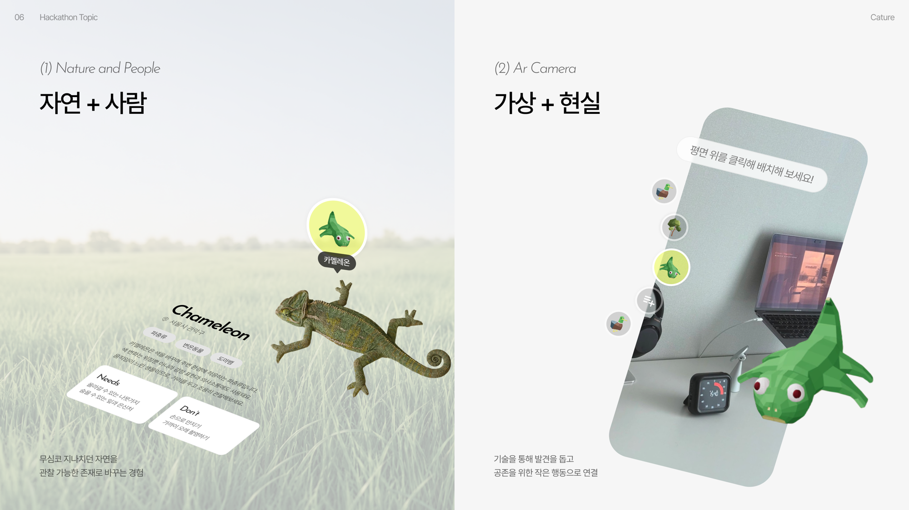

무심코 지나치던 자연을 **관찰 가능한 존재**로 바꾸고(자연 + 사람), 기술로 발견을 도와 **공존을 위한 작은 행동**으로 연결합니다(가상 + 현실).

---

## 🖌️ 디자인 시스템

색·폰트·간격을 **`DesignTokens` 패키지의 토큰으로만** 사용합니다(하드코딩 금지). 값이 바뀌어도 사용처는 그대로 — 디자인 SSOT를 한 곳에서 관리합니다.

### 🎨 컬러

| 토큰 | 값 | 용도 |
|---|---|---|
| `accent` / `lime` | `#F4FE7D` 🟡 | 메인 브랜드 라임 — 강조·선택·CTA |
| `ink` | `#282828` ⬛ | 어두운 버튼·잉크 텍스트 |
| `darkSurface` | `#0D0F18` | 카메라·분석·체험 다크 배경 |
| `surface` | `#FFFFFF` ⬜ | 홈·지도 라이트 배경 |
| `textPrimary` | `#171C1C` | 기본 텍스트 |

### 🌗 톤 분리 — 화면 목적에 따라 라이트/다크

두 개의 `CatureAppearance`로 화면 성격을 나눕니다.

- **`.light`** — **홈 · 지도 · 도감** (화이트/뉴트럴). 편안하게 둘러보는 공간.
- **`.dark`** — **카메라 · 분석 · 공존 카드 · 수집 연출 · AR** (딥그레이/블랙). 몰입해서 발견·체험하는 공간.

### 🔤 타이포 & 컴포넌트

- **Pretendard** 기반 타입 스케일 (`largeTitle` → `caption`). 폰트 교체는 `Typography.swift` 한 곳만.
- 재사용 컴포넌트: `catureCard(.light/.dark)` · `caturePillTab` · `buttonStyle(.caturePrimary)`.
- 간격 `xxs`(4) ~ `xxl`(48), 라운드 `card`(20) / `md`(14) / `pill` 로 리듬 통일.

> 자세한 사용법 → [`docs/tokens.md`](docs/tokens.md)

---

## 💎 Core Value — 세 가지 핵심 경험

Cature는 생물을 **발견**하고, 공존 방식을 **이해**하며, 해치지 않는 방식으로 다시 **경험**하는 흐름을 만듭니다. 이를 통해 사용자는 일상 속 생명을 *배경이 아닌 함께 살아가는 존재*로 인식하게 됩니다.

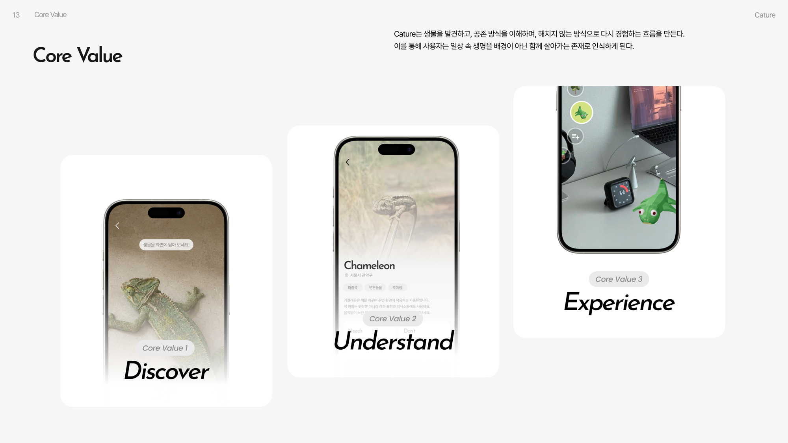

### ① Discover — 도시 속 생명을 발견하다

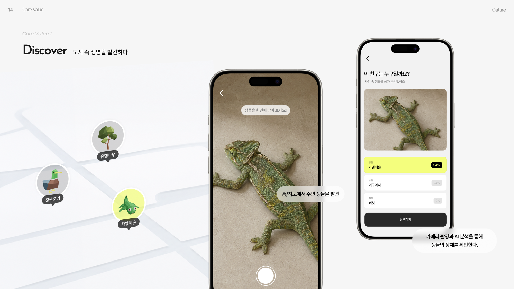

홈·지도에서 주변 생물을 발견하고, **카메라 촬영 + AI 분석**으로 정체를 확인합니다. LLM이 후보 종을 신뢰도(%)와 함께 제시하면 사용자가 최종 선택합니다. *(예: 카멜레온 94% · 이구아나 24% · 버섯 2%)*

### ② Understand — 공존 방식을 이해하다

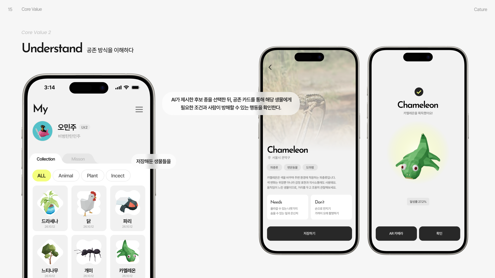

AI가 제시한 후보 종을 선택한 뒤, **공존 카드**로 그 생물에게 *필요한 조건(**Needs**)* 과 *사람이 방해할 수 있는 행동(**Don’t**)* 을 확인합니다. 확인한 생물은 **도감(My)**에 수집되어 카테고리별로 쌓입니다.

### ③ Experience — 발견을 다시 체험하다

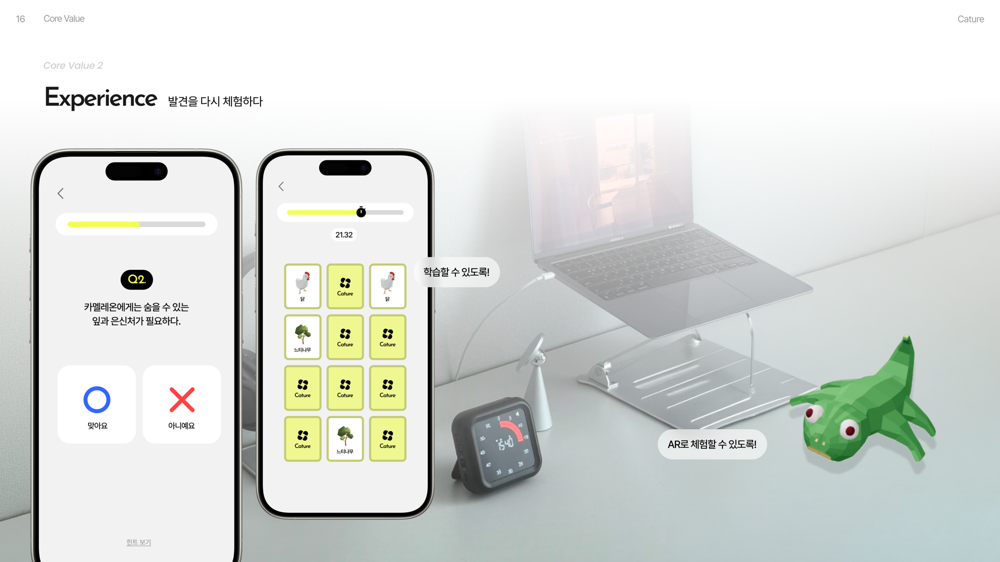

수집한 생물을 다시 만납니다. **OX 퀴즈**로 공존 행동을 학습하고, **카드 짝맞추기**로 종을 익히며, **AR 체험**으로 3D 모델을 눈앞의 평면에 불러냅니다. *학습할 수 있도록, AR로 체험할 수 있도록.*

---

## 🔄 Core Flow

주변 생물을 발견·촬영하면, AI가 후보 종을 제시하고 공존 카드로 이해를 돕고, 이후 AR 체험과 미니게임으로 발견 경험을 확장합니다.

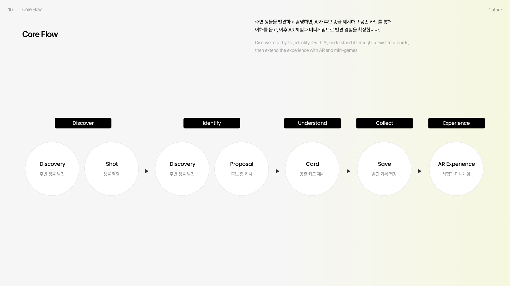

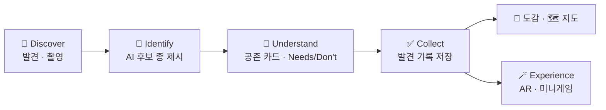

### 정보 구조 (IA)

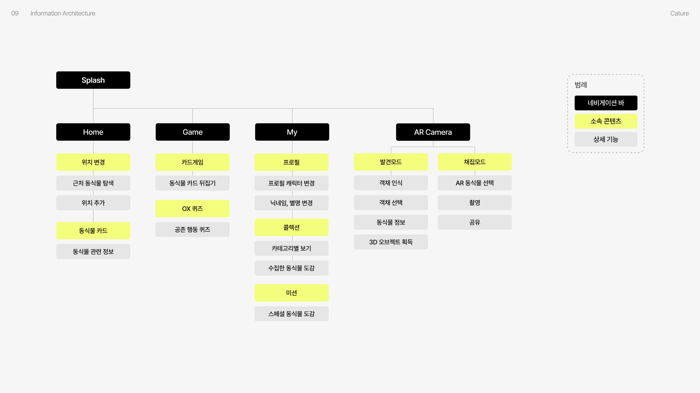

`Splash`에서 **Home · Game · My · AR Camera** 네 축으로 뻗어나가는 구조. 하단 탭 `Home` · `Game` · `My` + 중앙 로고 FAB(카메라 발견 진입)로 연결됩니다.

---

## 📱 실제 화면

시뮬레이터에서 캡처한 실제 구현 화면입니다. (AR·촬영·위치는 실기기 iPhone에서 동작)

<table>
  <tr>
    <td align="center" width="25%"><br/><sub><b>발견 지도</b><br/>주변 생명을 핀으로</sub></td>
    <td align="center" width="25%"><br/><sub><b>공존 카드</b><br/>Needs · Don’t</sub></td>
    <td align="center" width="25%"><br/><sub><b>획득 완료</b><br/>수집 연출</sub></td>
    <td align="center" width="25%"><br/><sub><b>도감(My)</b><br/>카테고리 필터 · 그리드</sub></td>
  </tr>
  <tr>
    <td align="center"><br/><sub><b>미니게임 허브</b><br/>게임 선택</sub></td>
    <td align="center"><br/><sub><b>카드 짝맞추기</b><br/>Catch the Pair</sub></td>
    <td align="center"><br/><sub><b>OX 퀴즈</b><br/>True or False</sub></td>
    <td align="center"><sub>🪄 <b>AR 체험</b><br/>usdz 모델을 평면에<br/><i>(실기기 전용)</i></sub></td>
  </tr>
</table>

---

## 🎮 주요 기능

| | 기능 | 설명 |
|---|---|---|
| 🏠 | **홈 · 지도** | 발견한 생명을 장소별로 모아 보는 모노톤 지도 + 장소 필터 |
| 📸 | **발견 플로우** | 카메라 촬영 → AI 분석 → 공존 카드 → 획득 완료 연출 |
| 🧠 | **LLM 분석** | OpenAI 기반 개체 식별 + 공존 정보(필요 조건 / 방해 행동), Mock 폴백 |
| 📖 | **도감 (My)** | 프로필 · 카테고리 필터(동물·식물·곤충) · 3열 그리드 · 종 상세 |
| 🪄 | **AR 체험** | RealityKit `usdz` 모델을 평면에 배치, 이동·회전·확대 제스처 |
| 🕹️ | **미니게임** | 카드 짝맞추기(Catch the Pair) · True or False OX 퀴즈 |
| 👋 | **온보딩** | 첫 진입 안내 플로우 |

**하단 탭:** `Home` · `Game` · `My` + 중앙 로고 FAB(카메라 발견 진입)

---

## 🧱 아키텍처

**계약 중심 · 의존성 0 코어.** 모든 Feature는 실구현이 아니라 **Core 프로토콜**에 의존하고, 주입(DI)으로 Mock ↔ 실구현을 갈아 끼웁니다. 덕분에 3인 팀이 병렬로, Mock-first로 개발했습니다.

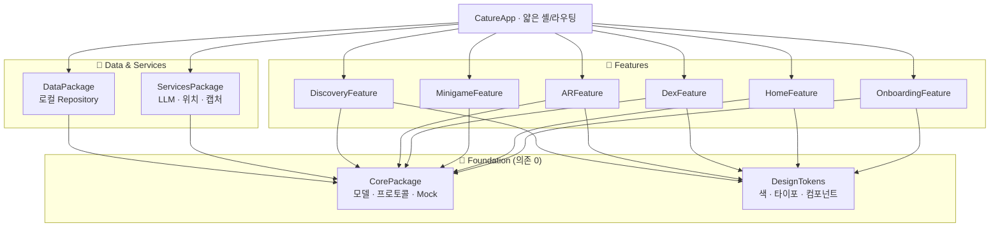

**불변식**
- `CorePackage` · `DesignTokens`는 **의존 0** — 순수 계약/디자인 레이어
- 로직은 패키지에, **앱 타깃은 얇게**(셸 · 라우팅만)
- 색 · 폰트는 하드코딩 금지 → `DesignTokens` 토큰으로만
- 3D 에셋은 `Assets3D/` 한 곳, **Git LFS**로 추적

---

## 🛠️ 기술 스택

| 영역 | 사용 기술 |
|---|---|
| **언어 · UI** | Swift 6.0 · SwiftUI |
| **AR** | ARKit · RealityKit · USDZ |
| **AI** | OpenAI LLM (개체 분석 · 공존 정보) |
| **위치 · 캡처** | CoreLocation · AVFoundation |
| **저장** | 로컬 Repository (온디바이스) |
| **패키징** | Swift Package Manager (로컬 멀티패키지) · Git LFS |
| **디자인** | DesignTokens (색·타이포·컴포넌트 SSOT) · Pretendard |

---

## 📂 프로젝트 구조

```
Cature/
├─ CatureApp/            # 앱 셸 · 탭 · 라우팅 (얇게)
├─ Cature.xcodeproj
├─ Packages/
│  ├─ CorePackage/       # 모델 · 프로토콜 · Mock (의존 0)
│  ├─ DesignTokens/      # 색 · 타이포 · 컴포넌트 (의존 0)
│  ├─ DataPackage/       # 로컬 Repository 구현
│  ├─ ServicesPackage/   # LLM · 위치 · 캡처
│  ├─ DiscoveryFeature/  # 카메라 · 분석 · 공존 카드 · 수집 연출
│  ├─ ARFeature/         # RealityKit usdz 체험
│  ├─ DexFeature/        # 도감(My) · 종 상세
│  ├─ MinigameFeature/   # 카드 짝맞추기 · OX 퀴즈
│  ├─ HomeFeature/       # 홈 · 지도
│  └─ OnboardingFeature/ # 온보딩
├─ Assets3D/             # usdz/glb 3D 에셋 (Git LFS)
└─ docs/                 # PRD · 협업 프로세스 · 디자인 토큰 · 발표 자료(deck)
```

---

## 🚀 빌드 & 실행

> **요구 사항:** macOS · Xcode 16+ · iOS 17+ · [Git LFS](https://git-lfs.com)

```bash
# 1) 클론 + LFS 3D 에셋 받기
git clone https://github.com/cherrymixy/Cature.git
cd Cature
git lfs install && git lfs pull

# 2) 앱 전체 그래프 빌드 (10개 패키지 + 앱)
xcodebuild -project Cature.xcodeproj -scheme CatureApp \
  -destination 'generic/platform=iOS Simulator' build

# 3) 개별 패키지 단독 컴파일
cd Packages/CorePackage && swift build
```

또는 `Cature.xcodeproj`를 Xcode에서 열고 **CatureApp** 스킴으로 실행하세요.

> 📱 **AR · 촬영 · 위치는 실기기(iPhone) 검증** 권장 — 시뮬레이터에서는 카메라/AR 렌더가 제한됩니다.

---

## 👥 팀 & 협업

3인 병렬 개발. **공유 표면(Core · 토큰 · 셸)을 먼저 얼려** 병렬 개발의 관문을 열고, 각자 Feature를 Mock-first로 구현했습니다.

| 이름 | 도구 | 담당 |
|---|---|---|
| **승아** | Claude Code | 초기 세팅 · 발견 플로우 · AR |
| **찬희** | Codex | 도감 · 미니게임 |
| **예준** | Codex | 홈 · 온보딩 |

---

## 📚 문서

| 문서 | 내용 |
|---|---|
| [`docs/PRD.md`](docs/PRD.md) | 제품 요구사항 · 빌드 SSOT |
| [`docs/협업_프로세스.md`](docs/협업_프로세스.md) | 3인 협업 모델 · 도구 분업 |
| [`docs/contracts.md`](docs/contracts.md) | Core 계약(프로토콜) 명세 |
| [`docs/tokens.md`](docs/tokens.md) | 디자인 토큰 사용법 |
| [`docs/deck/`](docs/deck/) | 발표 자료 슬라이드 |
| [`docs/playbook/`](docs/playbook/) | 빌드 플레이북(관문 · 타임라인) |

<div align="center">
<br/>

**🌿 Cature** — 발견에서 공존으로.

<sub>Catch + Nature · 🏆 Lab Void 바이브코딩 해커톤 1위 · Team LAB VOID</sub>

</div>
